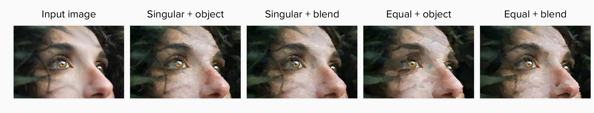

# The Painter's Eye

## Introduction

With the recent advances in the fields of Neural Networks and Computer Vision, there has been a rising interest in making AIs generate paintings. However, humans do not perceive or create a painting pixel per pixel. We focus on objects and details, on the things that call out for us from the canvas.
The aim of this research project is to teach an artificial intelligence to paint as a real painter would. Using semantic segmentation to identify the shapes in an image and saliency maps to get the most attracting points, I will try to model an attention mechanism that will drive the painting process of a neural renderer, making it focus more on the most relevant objects.

## Structure

The final painter is composed by three main neural networks (one for segmentation, one for saliency and one for painting) and some helper functions to process the image. The following diagram illustrates the high-level structure of the software from input to output.

### 1. Resizing the image

To prevent Colab's GPUs from running out of memory while painting, the image is first passed through a function that resizes it. This function maintains the height-width ratio of the original image, and scales it down so that the smallest side is 512.

### 2. Detectron2

Detectron2 is a powerful AI library by Meta Research that provides algorithms for object detection and segmentation in pictures and videos. Developed in PyTorch, the implementation can be found in their [GitHub page](https://github.com/facebookresearch/detectron2). 

The `semantic_seg()` function in `map_generation.py` relies on Detectron2 to perform panoptic segmentation of the input image. Panoptic segmentation blends instance detection with semantic segmentation: it tries to divide the pixels in the image based on the class to which they belong (semantic segmentation), while also identifying instances of the classes (instance detection). First, the function downloads the configuration file from the Detectron's model zoo, and it uses it to download the network checkpoint and to instantiate the predictor. Then, it loads the input image and processes it with the predictor, obtaining the `panoptic_matrix` and the `segments_info`. The latter is a list with info on all the objects identified, while the former is a matrix of size height\*width of the input image, and it stores the id of each object in the positiong where the object is in the image (as illustrated in the picture below). 

The function creates a panoptic image by stacking three panoptic matrices along a new dimension (to act like the color channels). Then, for each object in the `segments_info` list, it creates a binary mask of the object, creating a copy of the panoptic image filled with zeros, and setting it to one where the panoptic image matches the object id. Finally, it stores the segments in the `segments` folder.

### 3. SalGAN

SalGAN is deep convolutional neural network for visual saliency prediction, trained in adversarial fashion. Given an input image, it produces a prediction of the image's saliency map, defined as the most important parts of the image (the places where the eyes of an observer are most likely to focus on). 

The `sal_map_generator()` function in `map_generation.py` relies on the [PyTorch implementation of SalGAN](https://github.com/niujinshuchong/SalGan_pytorch). It loads the network checkpoint, then loads the input image and feeds it to the network to get the saliency map. Lastly, it stores the result in the `saliency` folder. 

### 4. Map Generation

The map generation function creates two different maps to drive the painting process using the saliency map and the binary masks of the objects. It takes the mean of the pixels that compose each object (according to the binary masks) in the saliency map, obtaining the mean saliency of each object. If an object's mean saliency is higher than 0.1, then the object is considered important and is included in the final maps. The first of the final maps (called final) is just another binary mask including all the objects that were found to be important. The second map (blend) is the saliency map shaped according to the final map (set to 0 where the final binary mask is 0). 

### 5. Painter

For the painter, we choose as baseline the Stylized Neural Renderer proposed by [Zou et al](https://arxiv.org/abs/2011.08114). (the code is available on their [GitHub](https://github.com/jiupinjia/stylized-neural-painting) page). 

The painter has three main components:
* a network, the renderer, trained to generate and render brushstrokes from stroke vectors,
* a blender that blends brushstrokes so they remain differentiable
* and a final component to measure the loss and enforce similarity with the original picture.

The approach proposed by Zou et al. is innovative in the structure of the renderer. It is divided in two networks:

* a rasterisation network, made of a positional encoder and a pixel decoder
* and a shading network, made of transposed convolutional layers.

Each stroke x is represented as a vector. The parameters of each vectors are divided into color, shape and transparency. Both color and shape are fed to the shading network, that predicts the stroke's foreground color. The shape is also used by the rasterisation network, which produces a clear shilouette of the stroke. Finally, the foreground color is masked with the shilouette, and the shilouette is multiplied by the transparency parameter to get the alpha matte. 

Once the foreground and alpha matte of a stroke have been predicted, they need to be added to the canvas. The approach uses a soft blending technique, where the canvas h at stroke k is equal to the alpha matte of k multiplied by its foreground, plus the canvas at stroke k-1 times 1-alpha. In this way, the strokes are completely differentiable. The strokes up to k are grouped into an active set, and they are optimised to minimise the difference with the original picture. 

#### Stroke distribution

In the baseline painting program - progressive painter version - the image is gradually divided into smaller patches. For instance, if the `max_divide` parameter is 3, the image will be sequentially divided into 1, 4 and 9 patches. Each patch will get the same number of brushstrokes, equal to the maximum amount of strokes divided by the number of patches. 

Here is where we try a different approach compared to the baseline. Instead of giving the same number of strokes to each patch, we distribute weights according to the object and the blend map. We distribute weights in two different ways, "equal" and "individual". The weights are distributed at each layer (so with `max_divide = 3` weights are distributed once with one patch, once with 4 and once with 9), using as total strokes for the layer the number of strokes attributed to each patch by the baseline times the number of patches.

##### Equal weight distribution

The equal weight distribution method uses the maps to decide which patches belong to what should be the foreground or the background of the painting. It calculates the weight of each patch in the layer depending on the map that is being used:
* with the object map (binary), it just counts how many pixels are non-zero,
* with the blend map, it takes ratio of the sum of the patch and the sum of the whole map.

It then uses two different thresholds (50 percent of the pixels for the object map, and the inverse of the number of patches for the blend map) to decide which patches will belong to the background and which to the foreground. 

By default, the background patches will receive 30% of the total strokes for the layer, while the foreground ones will receive the remaining 70%. If there is no background or foreground, the other receives 100% of the strokes. The 30% of the total strokes are then divided equally among the background patches (same for the foreground).

##### Singular weight distribution

In a similar way to the equal weight distribution, the singular mode first attributes a weight to each patch in the layer acccording to the used map:

* for the object map, it takes the ratio between the number of non-zero values in the patch and in the whole map,
* for the blend map, it takes ratio of the sum of the patch and the sum of the whole map.

If any patch has a weight less than 0.05, the weight for that patch is set to 0.05 to prevent the painter from leaving empty spaces on the canvas. Then, to get the number of strokes for each patch, it simply multiplies the total number of strokes for the layer by the weight of the patch.

 

This gives rise to 4 variations from the baseline:

* Singular weight distribution + object map
* Singular weight distribution + blend map
* Equal weight distribution + object map
* Equal weight distribution + blend map

Here is an example of the different results from the same input image:

Note: in case none of the objects is considered as relevant (so the final maps are empty), the weight distribution reverses back to the baseline mode, assigning the same number of brushstrokes to each patch.

## References

*Note: this section only includes the main references. The final dissertation will include all of them*

Nakano, R., 2019. Neural Painters: A learned differentiable constraint for generating brushstroke paintings. arXiv:1904.08410.

> Nakano, R., Neural renderer [GitHub](https://github.com/reiinakano/neural-painters-pytorch/tree/master/neural_painters)

> LibreAI neural renderer [GitHub](https://github.com/libreai/neural-painters-x)

Zou, Z., Shi, T., Qiu, S., Yuan, Y., Michigan, Z.S.U. of, Arbor, A., Lab, N.F.A., University, B., 2021. Stylized Neural Painting, in: CVPR.

> Zou, Z., Neural renderer [GitHub](https://github.com/jiupinjia/stylized-neural-painting)

## Project-related material

Link to the dissertation material folder on google drive (includes meeting minutes, project briefs, and research material):
[Dissertation Material](https://drive.google.com/drive/folders/1G2O_FanmPbNt1FlOE2I4gvPyI7F_sztO?usp=sharing)

## Run the program

The painting program is available to run on Colab.

It will first make you to clone this git repository and install detectron and other packages. It will make you download all the relevant checkpoints and upload images to paint. Then, you will be able to set all the parameters and run the painting process. If you do not want to input an image, a default one is already available in the input folder (`more-points.jpg`). The average time to paint an image is around 15-20 minutes, depending on the amount of brushstrokes and the weight distribution (usually faster with `equal` weights).

The program is not available to run on local machine yet as it requires GPU support. 
